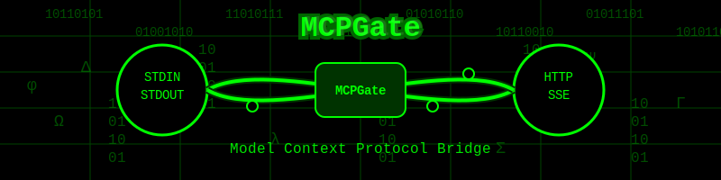
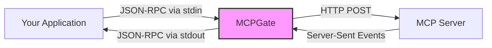

# MCPGate

<div align="center">
  
  <p><strong>Robust stdio-to-HTTP bridge for Model Context Protocol (MCP) connections</strong></p>
  <p>
    <a href="#installation">Installation</a> •
    <a href="#usage">Usage</a> •
    <a href="#features">Features</a> •
    <a href="#how-it-works">How It Works</a> •
    <a href="#examples">Examples</a> •
    <a href="#troubleshooting">Troubleshooting</a>
  </p>
</div>

## What is MCPGate?

MCPGate creates a resilient bidirectional bridge between standard I/O and HTTP, enabling any application to communicate with MCP servers. It handles all the complexity of connection management, session persistence, and error recovery.

Built on the official [`@modelcontextprotocol/sdk`](https://www.npmjs.com/package/@modelcontextprotocol/sdk), MCPGate provides a robust implementation of the MCP client specification with enhanced reliability features.



## Features

- ⚡ **Reliable Communication** - Stable bridge between stdin/stdout and HTTP/SSE
- 🔄 **Smart Reconnection** - Automatic recovery from network issues and session timeouts
- 🔐 **Session Management** - Preserves sessions when possible, graceful fallbacks when not
- 📋 **Message Queuing** - No messages lost during connection interruptions
- 🚦 **Intelligent Error Handling** - Different strategies for different error types
- 📦 **Lightweight** - Minimal dependencies, focused functionality

## Installation

```bash
# Install globally via npm
npm install -g mcpgate

# Or use without installation via npx
npx mcpgate http://example.com:8000/sse
```

## Usage

### Basic Command

```bash
mcpgate <server-url>
```

### With Options

```bash
mcpgate http://example.com:8000/sse --debug --reconnect-delay=2000 --max-reconnects=10
```

### In an MCP Client Configuration

```json
{
  "mcpServers": {
    "your-servername": {
      "command": "npx",
      "args": ["-y", "mcpgate", "http://example.com:8000/sse"]
    }
  }
}
```

## How It Works

MCPGate establishes and maintains the complex bidirectional connection required by the Model Context Protocol:

1. **Connection Setup**
   - Creates an SSE connection to receive server messages
   - Obtains the endpoint URL for sending messages via POST

2. **Message Handling**
   - Reads JSON-RPC messages from stdin
   - Queues messages when connection isn't ready
   - Sends messages to server via HTTP POST
   - Receives responses via SSE and forwards to stdout

3. **Advanced Reconnection**
   - Detects connection failures through multiple signals
   - Uses exponential backoff for reconnection attempts
   - Preserves original session ID when possible
   - Falls back to new session when necessary
   - Re-executes handshake sequence after reconnection

## Examples

### Simple Pipe

```bash
echo '{"jsonrpc":"2.0","method":"chat","params":{"message":"Hello"},"id":1}' | mcpgate http://localhost:8000/sse
```

### Integration with Tools

```bash
# Use with a custom client
my-mcp-client | mcpgate http://example.com:8000/sse | result-processor
```

### Debugging

```bash
# Save logs to a file while using the bridge
mcpgate http://example.com:8000/sse 2> mcpgate.log
```

## Technical Details

### Architecture

MCPGate uses a clean module pattern with clear separation of concerns:

- **Connection Management** - Transport and session lifecycle
- **Message Processing** - Queue and send messages
- **Event Handling** - Process SSE events
- **Error Management** - Classify and respond to errors

### Dependencies

MCPGate builds upon three key libraries:
- **@modelcontextprotocol/sdk** - Core MCP client implementation
- **eventsource** - Server-Sent Events client for node.js
- **node-fetch** - Lightweight fetch implementation

These dependencies should be automatically installed when you install mcpgate, so there's no need to install them separately.

### Session Persistence Strategy

1. Initial connection establishes a unique session ID
2. On disconnection, attempts to reconnect with the same session ID
3. After multiple failures, falls back to a new session
4. Properly executes handshake sequence to reinitialize connection

## Troubleshooting

### Common Issues

| Problem | Possible Solution |
|---------|-------------------|
| Connection Refused | Ensure MCP server is running and URL is correct |
| Authentication Failures | Verify session credentials are valid |
| Frequent Disconnections | Check network stability and server timeout settings |
| Delayed Responses | Examine server logs for performance bottlenecks |

### Logs

All debug information is sent to stderr:

```bash
# Filter logs for specific events
mcpgate http://example.com:8000/sse 2>&1 | grep "reconnect"
```

## Contributing

Contributions are welcome! Please feel free to submit a Pull Request.

## License

This project is licensed under the MIT License - see the LICENSE file for details.

## Author

Martin Bukowski

---

<div align="center">
  <i>MCPGate: Bridging the gap between local applications and remote intelligence.</i>
</div> 